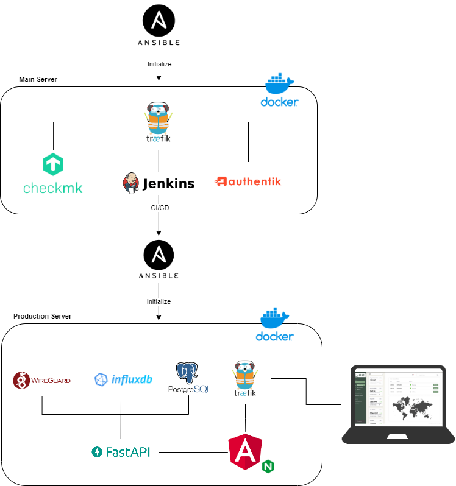

# Deployment 
## Setup 

### Main Server
Our main server, set up with Ansible, is the core of our infrastructure and contains the following components:

- Jenkins: For Continuous Integration and Continuous Deployment (CI/CD).
- Authentik: For identity management and authentication.
- Checkmk: For infrastructure monitoring.
- Traefik: As a reverse proxy and load balancer.

#### Monitoring (Checkmk)
Monitoring is crucial for maintaining the health of our infrastructure. With Checkmk, we get real-time insights into the performance of our systems and can react quickly to any problems.

#### CI/CD Pipeline (Jenkins)
Our CI/CD pipeline, implemented by Jenkins, plays a crucial role in setting up the production environment. Once the main server is operational and fully configured, the CI/CD pipeline ensures seamless deployment of the production environment.

#### Authentik
Authentik is our identity and access management solution that provides secure and streamlined authentication for our users. It integrates with various services and applications, giving us a central management point for all authentication needs.

#### Traefik
Traefik acts as our reverse proxy and load balancer, managing incoming traffic and routing it to the right services. It provides dynamic load balancing and integration with our container-based applications, ensuring optimal traffic distribution and high availability.

### Ansible
Ansible is a powerful automation tool we use for the initial set-up and configuration of our main server and production infrastructure components. It allows us to automate tasks such as software installations, configurations and maintenance.
### Production Environment
The production environment is set up through our CI/CD pipeline and contains the final applications and services available to end-users. 

#### WireGuard
WireGuard provides secure VPN connections that allow remote access to our gateways. This ensures that communications within our infrastructure remain secure and encrypted.

#### Gateway
The gateway acts as a communication point between the LoRa network and our system. A sensor sends messages to the gateway, using the LoRa communication protocol.

