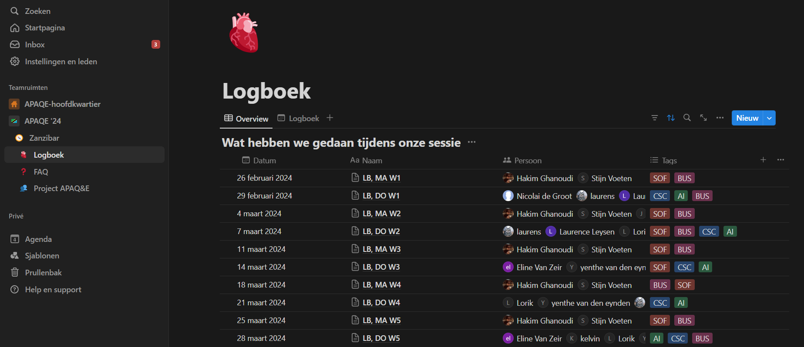
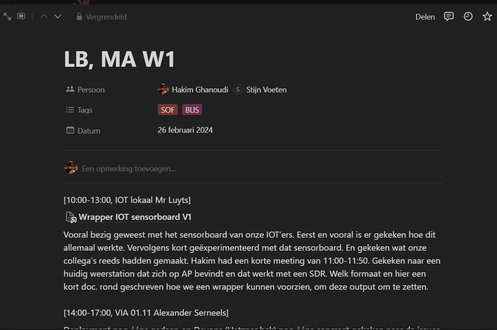

# Logbook

## Purpose

To ensure efficient use of time and resources, we maintained a logbook in Notion where each team member recorded their weekly session activities. This logbook was crucial for tracking progress, maintaining accountability, and optimizing resource allocation.

## Implementation

We used Notion to create a structured logbook where team members could log their tasks, hours worked, and any challenges faced during their work hours. This practice helped us:

- **Monitor Progress**: Keeping track of weekly session activities allowed us to monitor progress closely and identify any potential delays early.
- **Promote Accountability**: The logbook encouraged accountability among team members, as everyone was aware that their work hours were being recorded.
- **Optimize Resource Allocation**: By understanding how time was being spent, we could allocate resources more effectively and ensure that no time was wasted.

- **Facilitate Reflection and Improvement**: Regularly reviewing the logbook entries helped us reflect on our work patterns and make improvements where necessary.

## Example

These images shows an example of our Notion logbook, where team members documented their weekly tasks and progress. This tool was invaluable in maintaining transparency and ensuring that our team remained productive and focused throughout the project.
