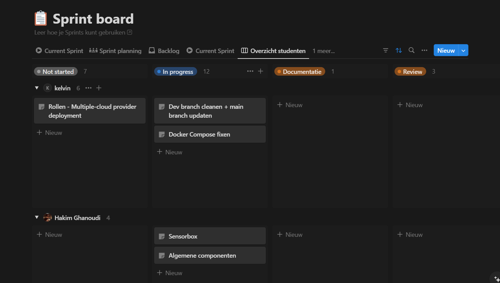

# Methodologies Employed for Managing the Project

## Agile

We adopted Agile methodologies to manage our project effectively. Agile is a flexible and iterative approach to project management that allows teams to deliver work in small, consumable increments. This method focuses on continuous improvement, scope flexibility, team input, and delivering essential quality products. Agile's emphasis on collaboration and responsiveness to change was particularly beneficial for our dynamic project environment, allowing us to adapt quickly to new information and stakeholder feedback.

## Kanban Board

In conjunction with Agile, we utilized a Kanban board to visualize our workflow and manage tasks efficiently. A Kanban board is a tool that helps teams visualize work, limit work-in-progress, and maximize efficiency. It typically consists of columns representing different stages of the workflow, such as "To Do," "In Progress," and "Done."

Our Kanban board allowed us to:

- **Visualize the Workflow**: We could see all tasks at a glance and understand their current status.
- **Limit Work-in-Progress**: By setting limits on the number of tasks in each stage, we avoided overloading team members and ensured a steady flow of work.
- **Improve Focus**: Team members could focus on completing tasks in progress before starting new ones, leading to higher quality outcomes.
- **Enhance Collaboration**: The board facilitated communication and collaboration among team members, as everyone could see what others were working on and where help might be needed.

In the example above, it is marked as 'sprint board', but we used it more like a Kanban board, not in sprints. Please disregard the 'sprint' label.

Using the Kanban board, we were able to manage our tasks more effectively and ensure that we stayed on track to meet our project goals. This visual and straightforward approach to task management complemented our Agile methodology, making it easier to adapt to changes and maintain productivity.
