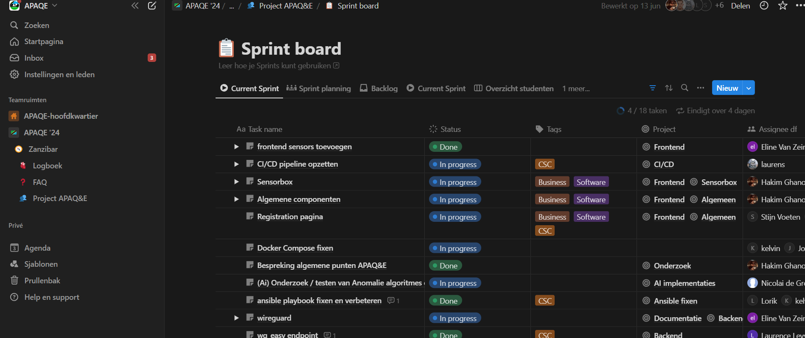

# Tools Used for Managing the Project

## Notion

[Notion](https://www.notion.so)

The most important tool for the project was Notion. Notion is a versatile platform that allows you to take notes, save documents, create kanban boards, and manage tasks all in one place. We used Notion extensively to organize our project documentation, plan our tasks, and keep track of our progress. Its collaborative features enabled all team members to stay updated and contribute efficiently. Additionally, Notion is great for taking notes, and it is free for single users, making it an accessible tool for individual use and preliminary project planning. It is a tool where you can easily combine everything to achieve a streamlined operation.

This is an example of a Notion sprintboard. We used this sprintboard more like a Kanban board rather than working in sprints.

## Discord

[Discord](https://discord.com/)

We primarily used Discord for communication and staying in touch with each other. Discord facilitated both text and voice communication, making it easy to discuss project-related matters and coordinate our efforts. Additionally, it was a great tool for informal conversations and staying connected about non-project-related topics, such as travel arrangements and social activities.

## Microsoft Teams

[Microsoft Teams](https://www.microsoft.com/en/microsoft-teams/group-chat-software)

We used Microsoft Teams to communicate with external stakeholders and for more formal meetings. Teams provided a professional platform for video conferencing, file sharing, and collaborative work. Its integration with other Microsoft Office applications allowed us to streamline our workflow and ensure that all team members had access to necessary resources and information.
