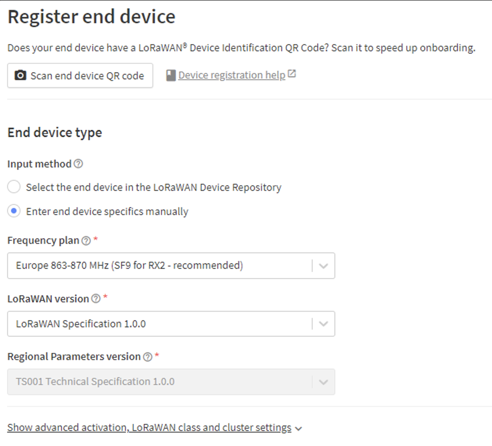

# Sensorbox documentation
To start of this sensorbox was used in several projects, here we are discussing the Zanzibar AQM one which has it's own quirks and nuances. For the updated code I'd like to refer to the following repo:
[Sensorbox repo](https://gitlab.apstudent.be/nox/sensor-box)

## Getting started
To get your first measurements in it's important to download platformIO. In this visual code extension you will be building and flashing the firmware for the sensorbox. Once downloaded you can clone the repo above and make a platformio.ini file in the code directory. Paste the following code in the ini file:
```
; PlatformIO Project Configuration File
;
;   Build options: build flags, source filter
;   Upload options: custom upload port, speed and extra flags
;   Library options: dependencies, extra library storages
;   Advanced options: extra scripting
;
; Please visit documentation for the other options and examples
; https://docs.platformio.org/page/projectconf.html

[env:esp32-s3-devkitc-1]
platform = espressif32
board = esp32-s3-devkitc-1
framework = arduino
lib_deps = 
	mcci-catena/MCCI LoRaWAN LMIC library@^4.1.1
	sensirion/Sensirion Core@^0.6.0
	sensirion/Sensirion I2C SEN5X@^0.3.0
	adafruit/Adafruit BME280 Library@^2.2.4
build_flags = 
	-D ARDUINO_LMIC_PROJECT_CONFIG_H_SUPPRESS
	-D CFG_eu868=1
	-D CFG_sx1276_radio=1
monitor_speed = 115200
monitor_filters = 
	time
upload_port = /dev/cu.usbserial-1430 <---- change this for your own port
```
Now you can open the directory in Visual Studio Code and initialise the project. After platformIO has downloaded all dependancies it's important we edit a small part in the LMIC library, you can find the file by following this path: `code/.pio/libdeps/esp32-s3-devkitc-1/MCCI LoRaWAN LMIC library/src/hal/hal.cpp`. In this file, on line 416, uncomment the function `void hall_init()`. This is a duplicate and will give errors while building.

## Building and flashing
To build your project you can use the command palette in VSCode or use the shortcut `ctrl+alt+b` for Windows or `ctrl+option+b` for Mac. Normally you only get one warning about UART which can be ignored. If the projects builds without any problems you can try to flash the program to the sensorboard using `ctrl+alt+u` for Windows or `ctrl+option+u` for Mac. Make sure you enable the bootloader on the board by pressing the boot + enable button while uploading, this can be finicky at first... 

## TTN
[RFM95](resources/RFM95_96_97_98W.pdf)
[Lora](<resources/LoRa Modules V1.0.pdf>)

### registration on the things network

 

- Make an account on the things network
- Search for ttn console here you can find all off your applications 
- Add a new endpoint to your application
- Register device enter end device specifics manually
- Fill in the following parameters
- Frequency plan: europe 863-870 MHz
- LoRaWAN version: 1.0.0
- Regional Parameters: RP001 Regional Parameters 1.0.3 revision A
- JoinEUI : 0000000000000000
- DevEUI & AppKey : use the genrate function
- Fill in the JoinEUI, DevEUI and AppKey in the credentials.h, don't forget to fill in the DevEUI backwards!

## Troubleshooting
### Bootloop at startup triggered by WDT
This is mostly due to the os_init() function getting the wrong parameters for configuring the LMIC library, make sure all pin declarations are correct in the `configuration.h` file.
### Program hangs at TX_SENT
This was a hardware issue, the DIO_0 AND 1 line needs to be connected for LORA communication to work (PlatformIO Registry, n.d.). We fixed this by wiring the DIO_1 output of the LORA module to GPIO45.
### No join accept
Don't forget the antenna ;) 
### Brown out causing glitches
This is the 3,3V regulator being fed by the battery instead of 5V. The ESP isn't getting enough power because of this which is a huge design flaw. To fix this we soldered a connection between the battery connection on the regulator and the Vin of the esp32 making sure the connection to 3,3V is removed by scratching out the via. This brings extra vulnerabilities to the system which will be discussed in detail further on.

## Made changes
- DIO_1 connected to GPIO45
- Battery connected directly to esp
- Added OPAMP for amplifying the current sensor signal
- Used the BME280 for temperature and humidity measurement
- Added charge, fault and current to the data being sent by Lora

## Changes to be made
- Power delivery has to be revisioned.
  - 3,3V stabiliser
  - 5V boost converter
  - Protection (reversed polarity, shorts, ...)
- USB-C onboard would be very practical for easy testing
- Monitoring the battery voltage so the polling rate can be adjusted dynamically
- Swapping TX and RX on the board 
- Adding the pull-up resistors to the buttons

# Sources
PlatformIO Registry. (n.d.). PlatformIO Registry. Retrieved July 16, 2024, from https://registry.platformio.org/libraries/mcci-catena/MCCI%20LoRaWAN%20LMIC%20library#selecting-the-lorawan-region-configuration