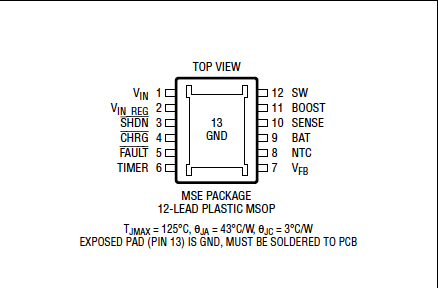

# Summary

## Key features

- 2A max loading current.
- Float voltage adjustable with voltage devider.
- Min 4.95V input voltage.
- No blocking diode necessary for batteries under 4.2V .

**Advantages:**

- Regulation loop for MPPT in solar applications.
- Broad voltage range (4,95 tot 32V).
- Controllable float voltage.
- Programmable load current.
- Low power mode.
- 2 open collector outputs for monitoring faults and charge status.
- Battery preconditioning at low voltage.

**Disadvantages:**

- Need to carefully choose the layout to minimize high frequency oscillations (see p.21 datasheet).
- Less protections than other IC's.
- Vin has to be 3,3V higer than the battery.

**Applications:**

- High precission elektronics.
- Audio-equipment.
- Medical equipment.
- Industrial appliances.

## Pin configuration

### Functions

**Pin1:** Charger input. (Vin - Vbat(flt)) ≥ 0.75V
4.95 - 32 V

**Pin 2:** Input voltage regulation reference. Used for programming minimum Vin voltage (max loadcurrent is droppe when this voltage drops below 2,7V).
If not used, connect to Vin.

**Pin3:** Shutdown pin, charging is halted when this pin drops below 0.4V. Connect to Vin if not used.

**Pin4:** Open-collector charger status output. Pulled-up to voltages as high as Vin. if the asked chargecurrent is higher than 1/10 of the programmable max current (C/10) this pin is pulled low.
Temperature fault will do the same.

**Pin5:**  Open-collector charge status output;
pulled up to ref. Stays high impedance when no fault is present, otherwise pulled to ground.

**Pin6:** End-Of-Cycle Timer programming.
For programming when the IC stops with charging. See datasheet for calculations.

**Pin7:** For programming the float voltage with a voltage devider. Best use resistor of 250k to avoid input bias faults.

**Pin8:** input of NTC (10kΩ, B = 3380 NTC) loading is stopped with temperatures above 40˚ = UNTC < .29V or lower than 0˚ UNTC >1,36V .

**Pin9:** Charger output, also used as reference for the current sense voltage.

**Pin10:** current sense pin, used to set maximum charge current.

**Pin11:** Bootstrapped supply rail for switch drive. 

**Pin12:** Switch output pin.

**Pin13:** Ground

## Application info

This IC can be put into low-current shutdown modue, the input supply bias is being lowered to 15µA.

If the IC is being powered by a solar panel the input regulation loop is being used to keep the panel at it's peak efficiency.

Detects a low voltage battery automatically and adjusts the load current accordingly.

If using the timer, the charge time can be elongated past the C/10 point to completely top up the battery. If this function is activated, the IC wil also detect a bad battery (this wil keep the IC in precondition mode for 1/8 of the total load time). 

After charging the IC switches to standby mode, in this mode the battery will be constantly monitored. Does it drop below 2,5% of the full-charge float voltage then a new cyclus will be started. The open collector pins can be used to view the current mode or to visualize faults.

Status pin 

## Typische applicatie

example schematic